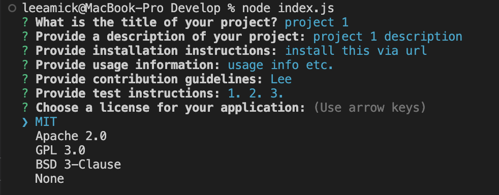

# Professional README Generator Starter Code

[How to create a Professional README](https://coding-boot-camp.github.io/full-stack/github/professional-readme-guide)

## Description

This is a simple command-line application that generates a high-quality README.md file based on user input.

## Example

## Table of Contents

- [Installation](#installation)
- [Usage](#usage)
- [Contributing](#contributing)
- [License](#license)
- [Questions](#questions)

## Installation

To install and use this application, follow these steps:

1. Clone this repository to your local machine.
2. Open a terminal window and navigate to the project directory.
3. Run the command `npm install` to install the necessary dependencies.

## Usage

To run the application, use the following command:
node index.js

Answer the prompts to provide information about your project, and a README.md file will be generated.

## Contributing

Contributions are welcome! Please fork the repository and submit a pull request with your changes.

## License

MIT license.

